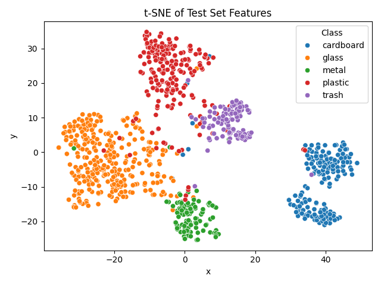
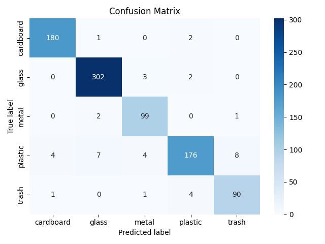
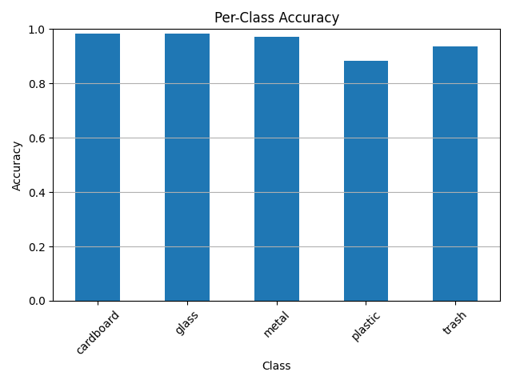
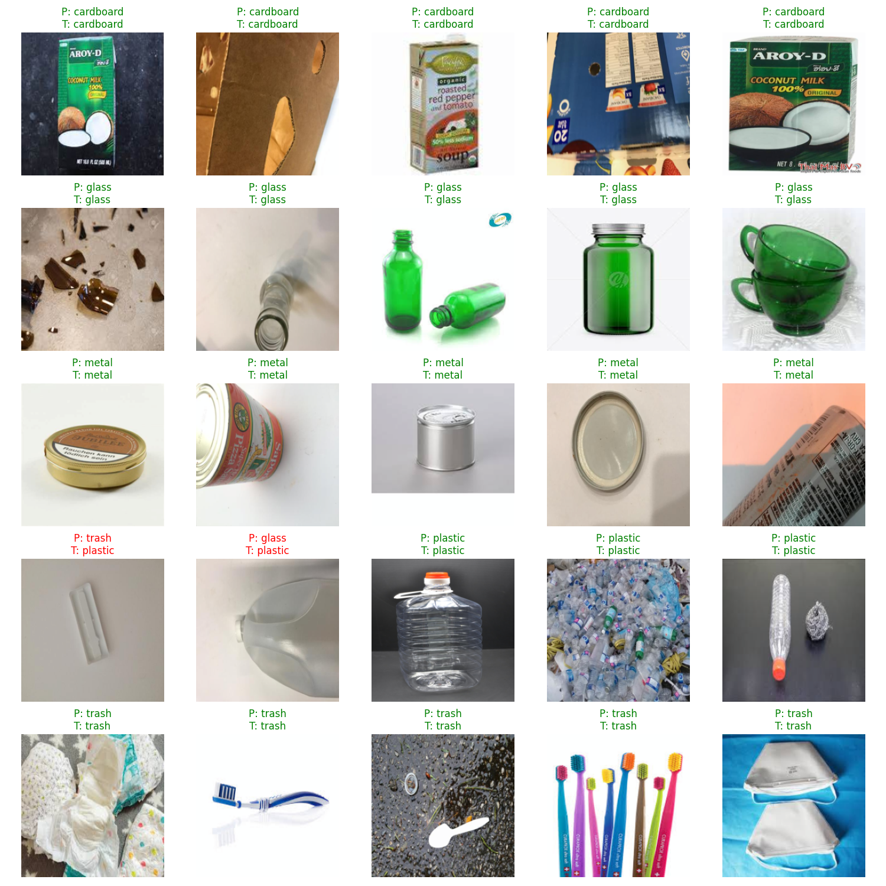

# Recycling Classifier

Multiclass PyTorch model that detects recycling material types from images. Built as the foundational model for an embedded Raspberry Pi robot. This model enables automation in sorting tasks for recycling waste.

## Project Structure
- Trained on a dataset of 5 recycling classes
    - Cardboard
    - Glass
    - Metal
    - Plastic
    - Trash
- Achieved **95%+ accuracy** on test data
- Model Evaluation and Insights: 
    - t-SNE visualization of learned feature embeddings
    - Confusion matrix highlighting class-level performance
    - Per-class accuracy bar chart
    - Prediction sample grid with correct/incorrect labels

## Demo Visualizations

<p float="left">
  
  
  
  
</p>

## How to Use

### Install dependencies
```bash
pip install -r requirements.txt
```

### Prepare Dataset
dataset/split/
├── train/
│   ├── cardboard/
│   ├── glass/
│   ├── metal/
│   ├── paper/
│   └── plastic/
├── val/
└── test/

### Train and Evaluate Model
```bash
python -m src.main
```

## Tech Stack
- Python
- PyTorch
- NumPy
- Pandas
- Matplotlib
- Seaborn
- Scikit-learn
- OpenCV

## Results Summary
- Model: Transfer learning with MobileNetV2
- Accuracy: 95.49% on test set
- Best classified: Cardboard, Glass
- Most confused: Trash

## Dataset Source
This dataset is a subset of the [Garbage Dataset](https://www.kaggle.com/datasets/sumn2u/garbage-classification-v2?resource=download)